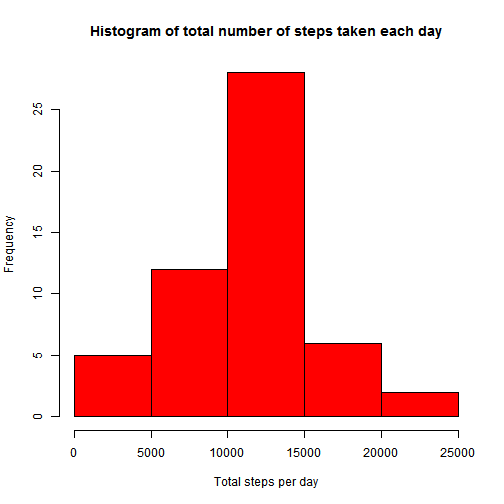
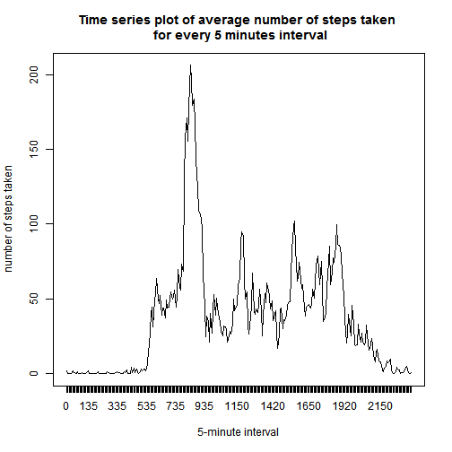
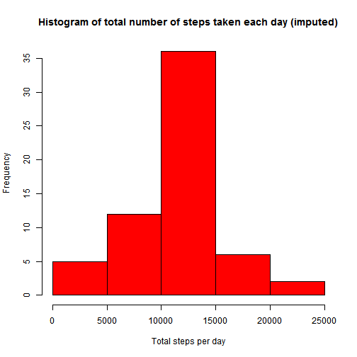
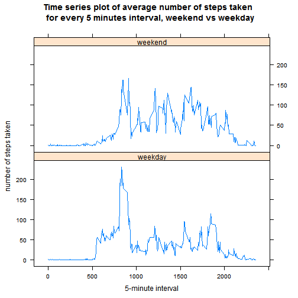

# Reproducible Research: Peer Assessment 1

## Loading and preprocessing the data

* unzip and load the data.
* reformat "date" variable into Date class. 


```r
data <- read.csv(unzip("activity.zip"))
data$date <- as.Date(strptime(data$date, format = "%Y-%m-%d"))
```

## What is mean total number of steps taken per day?

* generate vector summary of total number of steps taken each day.
* plot histogram of the summary vector.


```r
stepsum <- tapply(data$steps, data$date, sum)
hist(stepsum, col = "red", main = "Histogram of total number of steps taken each day", xlab = "Total steps per day")
```

 

* generate summary report of the summary vector including mean and median. Please the report below the code.


```r
meantotal <- mean(stepsum, na.rm = TRUE)
mediantotal <- median(stepsum, na.rm = TRUE)
meantotal
```

```
## [1] 10766
```

```r
mediantotal
```

```
## [1] 10765
```

### Report
### mean total number of steps taken per day is 1.0766 &times; 10<sup>4</sup> steps.
### median total number of steps taken per day is 10765 steps.

## What is the average daily activity pattern?

* generate vector summary of average number of steps taken for every 5-minute interval, averaged across all days.
* plot time series plot of the summary vector.


```r
stepsavg <- tapply(data$steps, data$interval, mean, na.rm = TRUE)
plot(stepsavg, type = "l", main = "Time series plot of average number of steps taken \n for every 5 minutes interval", xlab = "5-minute interval", ylab = "number of steps taken", xaxt = "n")
axis(1 , at = seq(stepsavg), labels = names(stepsavg))
```

 

* look up the summary vector for interval index of max average number of steps to answer the question.


```r
peakinterval <- names(stepsavg[stepsavg == max(stepsavg)])
peakinterval
```

```
## [1] "835"
```
### Answer
### on average across all the days in the dataset, the 5-minutes interval that contains the maximum number of steps is 835.

## Imputing missing values

* calculate and report the total number of missing values in the dataset.


```r
nummissing <- sum(is.na(data$steps))
nummissing
```

```
## [1] 2304
```
### Report
### number of missing values in the dataset is 2304.

* import plyr package.
* create a new dataset with the missing data filled in by mean of steps taken of the same 5-minute interval averaged across all days.


```r
library(plyr)
byinterval <- split(data, data$interval, drop = FALSE)
impute <- function(df){
        imputemean <- mean(df[,1], na.rm = TRUE)
        df[,1][is.na(df[,1])] <- imputemean
        df
        }
impute.data <- ldply(lapply(byinterval, impute))[,-1]
impute.data <- impute.data[order(impute.data$date, impute.data$interval),]
```

* with the imputed dataset, generate vector summary of total number of steps taken each day.
* plot histogram of the summary vector.


```r
stepsum2 <- tapply(impute.data$steps, impute.data$date, sum)
hist(stepsum2, col = "red", main = "Histogram of total number of steps taken each day (imputed)", xlab = "Total steps per day")
```

 

* generate summary report of the summary vector including mean and median. Please the report and answers below the code.


```r
meantotal2 <- mean(stepsum2)
mediantotal2 <- median(stepsum2)
meantotal2
```

```
## [1] 10766
```

```r
mediantotal2
```

```
## [1] 10766
```

### Report
### mean total number of steps taken per day (imputed data) is 1.0766 &times; 10<sup>4</sup> steps.
### median total number of steps taken per day (imputed data) is 1.0766 &times; 10<sup>4</sup> steps.
### Answer
### Mean and median values doesn't significantly differ from the estimates from the first part of the assignment.
### There is no impact of imputing missing data for this case.

## Are there differences in activity patterns between weekdays and weekends?

* create a new factor variable in the dataset with two levels - "weekday" and "weekend" indicating whether a given date is a weekday or weekend day.


```r
impute.data$day <- as.factor(weekdays(impute.data$date))
levels(impute.data$day)[which(levels(impute.data$day) %in% c("Saturday","Sunday"))] <- "weekend"
levels(impute.data$day)[which(!levels(impute.data$day) %in% c("weekend"))] <- "weekday"
```

* import reshape2 package.
* use melt function to melt the data so that ID variables are interval and day and measurement variable is steps data.
* reshape the melted data with dcast function with interval + day as x and (steps) variable as y. Use mean as aggregate function.
* use xyplot from lattice package to make a panel plot containing a time series plot of the 5-minute interval and the average number of steps taken, averaged across all weekday days or weekend days.


```r
library(lattice)
library(reshape2)
meltData <- melt(impute.data, id.vars = c("interval", "day"), measure.vars = "steps")
summaryData <- dcast(meltData, interval + day ~ variable, mean)
xyplot(steps ~ interval | day, data = summaryData, layout = c(1, 2), type = "l", main = "Time series plot of average number of steps taken \n for every 5 minutes interval, weekend vs weekday", xlab = "5-minute interval", ylab = "number of steps taken")
```

 
